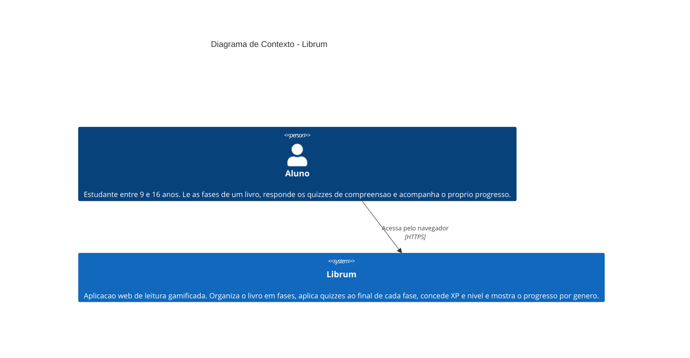
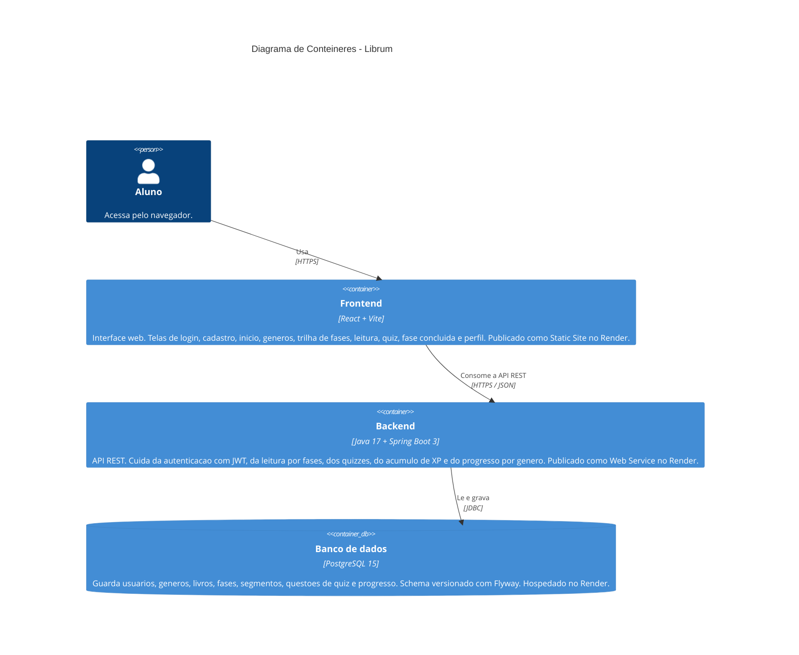

# Arquitetura do Librum

Este documento descreve a arquitetura do sistema Librum nos dois primeiros niveis do modelo C4: contexto do sistema (C1) e conteineres (C2). As decisoes de tecnologia e organizacao por tras dele estao registradas nas ADRs em `docs/adrs/`, listadas ao final.

---

## Nivel 1 - Contexto do sistema

O diagrama de contexto mostra quem usa o Librum e como ele se posiciona em relacao ao mundo externo.

No escopo do MVP o Librum e um sistema fechado: todas as funcionalidades sao entregues pela propria aplicacao, sem integracoes com servicos externos. A autenticacao usa JWT gerado e validado pelo proprio backend, sem provedor de identidade de terceiros.

---

## Nivel 2 - Conteineres

O diagrama de conteineres detalha as partes executaveis que compoem o Librum e como elas se comunicam.

As URLs publicas de staging estao em `docs/DEPLOY.md`: o frontend em `https://librum-frontend.onrender.com` e o backend em `https://projeto-librum.onrender.com`. O frontend descobre o backend pela variavel de ambiente `VITE_API_URL`.

### Responsabilidades de cada conteiner

**Frontend (React + Vite)**

- Renderiza as paginas da aplicacao: login, cadastro, inicio, generos, trilha de fases, leitura, quiz, fase concluida e perfil.
- Guarda o token JWT no `localStorage` e o envia no cabecalho `Authorization` de cada requisicao autenticada.
- Persiste as preferencias de leitura (fonte, espacamento e tema) no `localStorage`.
- Aplica o padrao Strategy nos temas de leitura (`readingThemes.js`, ADR-0012), trocando o visual da pagina de leitura sem condicional no componente.
- Nao contem regra de negocio: toda decisao de dominio fica no backend.

**Backend (Java 17 + Spring Boot 3)**

- Expoe uma API REST com os recursos `/auth`, `/reading`, `/genres`, `/quiz`, `/users` e `/progress`.
- Aplica os padroes de projeto registrados nas ADRs: Facade no `ReadingService` (ADR-0007), Command no `QuizService` (ADR-0008) e Template Method na regra de desbloqueio, hoje no `PhaseUnlockService` (ADR-0009 e ADR-0010).
- Gera e valida tokens JWT, sem manter estado de sessao no servidor.
- Versiona o schema do banco com migrations Flyway em `backend/src/main/resources/db/migration/`.

**Banco de dados (PostgreSQL 15)**

- Armazena as entidades principais: `users`, `genres`, `books`, `phases`, `phase_segments`, `quiz_questions` e `user_progress`.
- O schema e todo o conteudo (generos, o livro de Aventura, fases, segmentos e questoes) sao criados pelas migrations V1 a V10.

---

## Decisoes arquiteturais relacionadas

| ADR | Decisao |
|-----|---------|
| ADR-0001 | Linguagem e framework principal (React no frontend, Java com Spring Boot no backend) |
| ADR-0002 | Tipo de aplicacao (SPA web mais API REST) |
| ADR-0003 | Organizacao do projeto (monorepo com `backend/` e `frontend/`) |
| ADR-0004 | Banco de dados (PostgreSQL com Flyway) |
| ADR-0005 | Modelagem do usuario e autenticacao com JWT |
| ADR-0006 | Modelagem do conteudo literario e rastreamento de progresso |
| ADR-0007 | Facade no `ReadingService` |
| ADR-0008 | Command no `QuizService` |
| ADR-0009 | Template Method na verificacao de desbloqueio de fases |
| ADR-0010 | Extracao da regra de desbloqueio para o `PhaseUnlockService` |
| ADR-0011 | Design system, tipografia e organizacao de assets |
| ADR-0012 | Strategy para os temas de leitura |
